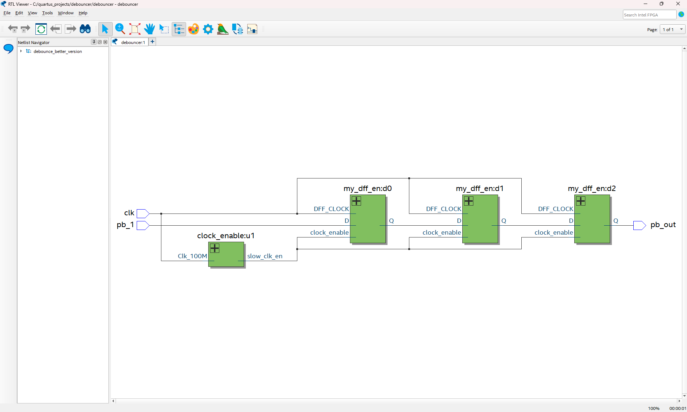
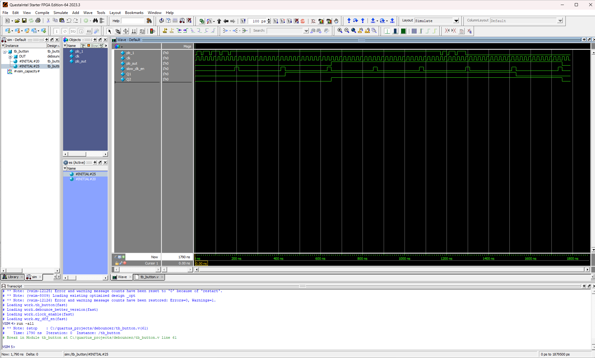

## Mini-challenge: Debouncer

## Descripción del proyecto
Este pequeño reto implementa un sistema debouncer, utilizando **Verilog HDL** en **Quartus Prime Lite**.

El sistema limpia la señal de un botón y produce un pulso de la misma duración que se presiona un botón.

## Estructura del proyecto
El proyecto está dividido en tres módulos esenciales:

## 1) Señal enable
- **Entrada**: Señal de reloj (400 Hz)
- **Salida**: Señal enable

Este módulo:
- La señal de reloj maneja un contador
- La señal enable se prende cuando el contador llega al máximo

## 2) D Flip Flop
- **Entrada**: Señal de reloj, señal enable, dato *D*
- **Salida**: Dato *Q*, donde *Q* es igual a *D* (considerando enable)

Este modulo:
- Es manejada por la señal de reloj
- Verifica que enable esté encendido antes de continuar
- Produce el dato *Q*, donde *Q* es igual a *D* 
- Funciona como retraso para verificar que una señal esté encendida

## 3) Módulo *top-level* debouncer
- **Entrada**: Señal de reloj, señal sin procesar de botón
- **Salida**: Señal procesada de botón

Este modulo:
- Procesa los rebotes de la señal de botón
- Produce una señal procesada al final
* La frecuencia de la señal enable es más lenta para tomar en cuenta la longitud completa de la señal del botón

## 4) Testbench
El **testbench** permite ejecutar una simulación del sistema en **ModelSim** para verificar que las salidas sean correctas.

Este modulo:
- Utiliza una señal de botón simulada
- Produce una señal limpia de la misma duración que la señal de botón
- Refleja el funcionamiento del debouncer
* La señal cruda tiene varios rebotes

### Visualización RTL Viewer:

### Visualización de onda:

## Conceptos aplicados
- Implementación de flip flops
- Instanciación para el testbench
- Señales enable a diferencia de divisores de reloj
- Soluciones digitales a problemas de hardware

## Resultado final
Al presionar un botón físico en la tarjeta MAX10, se limpian los rebotes físicos y se refleja solo un pulso de la misma duración que el botón fue presionado.
