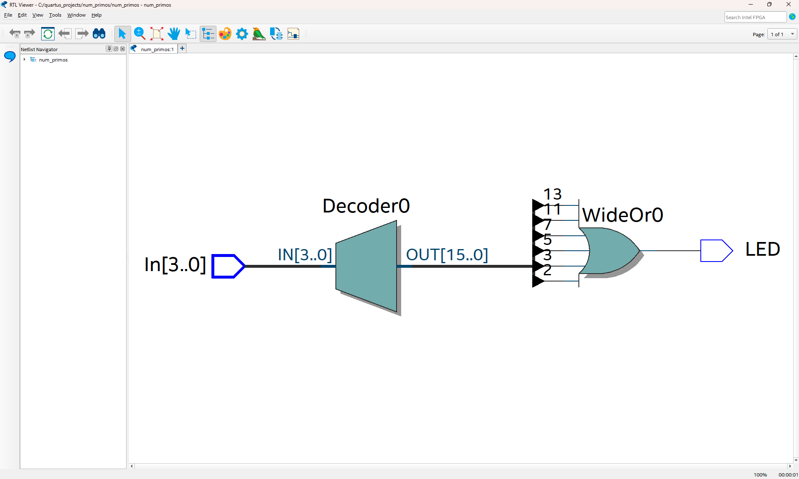

# Práctica #1: Detector de números primos 

## Descripción del proyecto
Este proyecto implementa un sistema de detección de números primos, utilizando **Verilog HDL** en **Quartus Prime**, ejecutándose en la tarjeta **DE-10 Lite**.

El sistema recibe un número binario de 4 bits (0-15) como entrada y acciona un LED si el número es primo.

## Estructura del proyecto
El proyecto está dividido en dos módulos principales:

## 1) Codificador 4 bits a LED
- **Entrada**: Valor binario de 4 bits (0-15)
- **Salida**: Señal digital (LED)

Este módulo:
- Convierte un valor decimal (0-15) en la señal correcta para el LED
- Escrito en forma de comportamiento (behavioral Verilog)
- Utiliza una estructura `case` en Verilog

## 2) Testbench
El **testbench** permite ejecutar una simulación del sistema en **ModelSim** para verificar que las salidas sean correctas.

Este modulo:
- Prueba los dieciséis entradas posibles
- Regresa la señal digital para el LED por cada caso
- Genera una visualización de onda en ModelSim

### Visualización RTL Viewer:

### Visualización de onda:

## Asignación de pines
- Switches[0:4]: Entrada binaria de 4 bits
- LED0: Salida de detección

Las asignaciones de pines se realizaron con **Pin Planner** de Quartus. Los pines fueron mapeados manualmente.

## Conceptos aplicados
- Conversión de binario a dígitos decimales
- Instanciación para el testbench
- Asignación de pines en FPGA
- Integración de lógica digital con hardware real

## Resultado final
Al ingresar un número binario con los switches de la FPGA DE-10 Lite, la luz LED (LED0) se prende si el valor es un número primo y se queda apagada en cualquier otro caso.

## Demostración con FPGA DE-10 Lite

