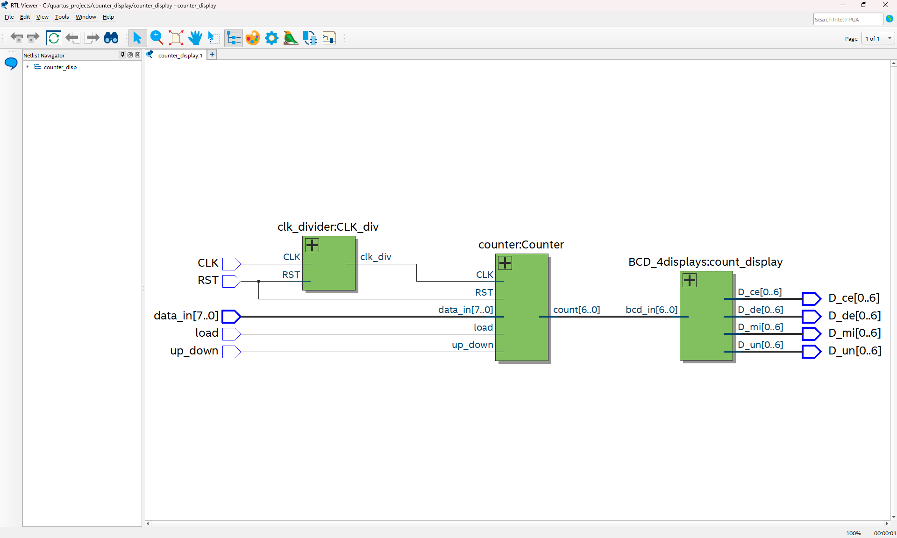
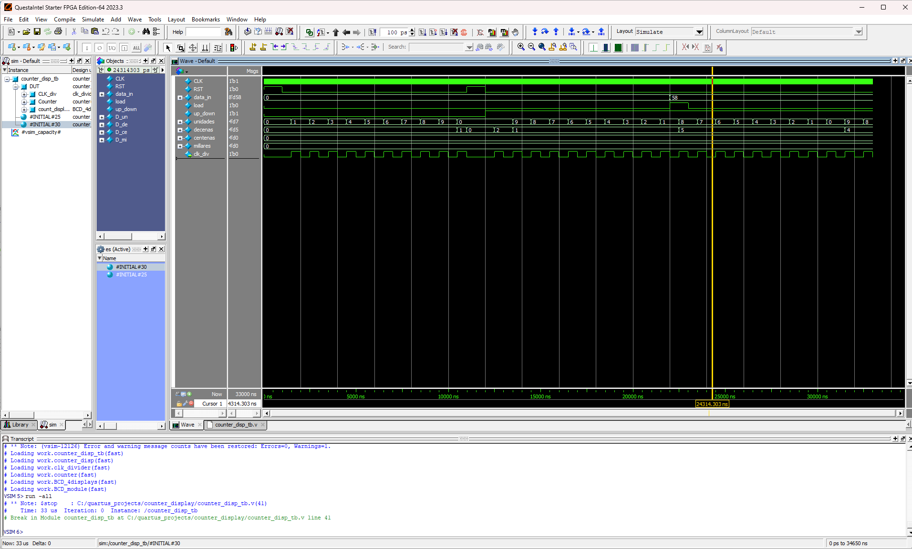

# Práctica #3: Display de contador 

## Descripción del proyecto
Este proyecto implementa un sistema de contador y 4 displays de 7 segmentos, utilizando **Verilog HDL** en **Quartus Prime**, ejecutándose en la tarjeta **DE-10 Lite**.

El sistema utiliza un contador de 0 a 100 para reflejar la cuenta en las pantallas de siete segmentos. Asimismo, implementa algunos interruptores para controlar la dirección de cuenta y/o especificar de donde se quiere comenzar la cuenta.

## Estructura del proyecto
El proyecto está dividido en siete módulos principales:

## 1) Divisor de reloj
- **Entrada**: Señal de reloj de la tarjeta
- **Salida**: Señal de reloj que simula segundos

Este módulo:
- Implementa un contador interno que sube y baja la señal de reloj dividida
- Produce una señal de reloj con un periodo de 1 segundo

## 2) Codificador BCD a 7 segmentos
- **Entrada**: Valor BCD de 4 bits (0-9)
- **Salida**: Señal de 4 bits (segmentos 0-6)

## 3) Conversor de 10 bits a 4 dígitos
- **Entrada**: Número binario de 10 bits
- **Salida**: Señales para cuatro displays de 7 segmentos

## 4) Testbench
El **testbench** permite ejecutar una simulación del sistema en *ModelSim* para verificar que las salidas sean correctas.

Este modulo:
- Refleja el cambio de la cuenta y la simulación de los switches
- Imprime los valores para los displays de cada dígito
- Genera una visualización de onda en ModelSim

### Visualización RTL Viewer:

### Visualización de onda:

## 5) Contador
- **Entrada**: Señal de reloj y *restart*, señal de carga, dato por cargar, dirección de la cuenta
- **Salida**: La cuenta

Este módulo:
- Hace la cuenta usando la señal de reloj de 1 segundo
- Cambia la cuenta dependiendo de la dirección
- Puede empezar la cuenta desde un número de entrada

## 6) Despliegue de la cuenta en las pantallas
- **Entrada**: Igual al contador
- **Salida**: Señales para cuatro displays de 7 segmentos

Este módulo:
- Instancia todos los módulos anteriores
- Resulta en el despliegue de la cuenta en las pantallas

## 7) Modulo Top-Level (Wrap)
El archivo _wrap_ conecta todo el diseño con la tarjeta DE-10 Lite:
- Señal de reloj de la tarjeta FPGA: de 50 MHz
- Switches: Entrada binaria de un valor, dirección de cuenta y señal de carga
- Displays HEX: Salidas de los 7 segmentos

Las asignaciones de pines se realizaron con *Pin Planner* de Quartus. Los pines se mapean automáticamente mediante un archivo de mapeo `.tcl` para la tarjeta DE-10 Lite.

## Conceptos aplicados
- Instanciación de modulos
- Conversión de binario a dígitos decimales
- Asignación de pines en FPGA
- Implementación de señales de reloj y contadores
- Integración de lógica digital con hardware real

## Resultado final
Se despliega una cuenta en las pantallas de siete segmentos. Se puede cambiar la dirección de la cuenta con uno de los switches. Además, se puede iniciar la cuenta desde un número que se carga con los interruptores.

## Demostración con FPGA DE-10 Lite

(Haz clic en la imágen para ver el video)
