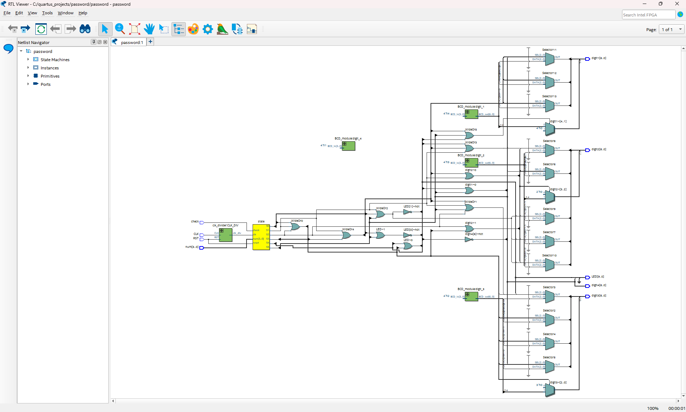
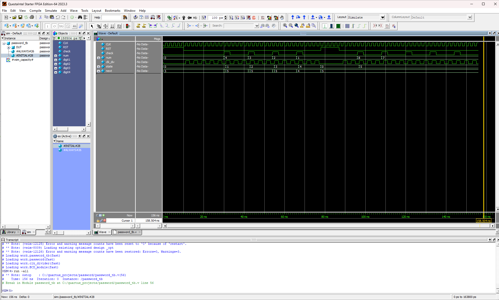

# Práctica #4: Contraseña FSM

## Descripción del proyecto
Este proyecto implementa un sistema de 4 displays de 7 segmentos, utilizando **Verilog HDL** en **Quartus Prime**, ejecutándose en la tarjeta **DE-10 Lite**.

El sistema recibe un número binario de 10 bits (0-1023) como entrada y muestra su equivalente decimal en los cuatro displays.

## Estructura del proyecto
El proyecto está dividido en cuatro módulos principales:

## 1) Codificador BCD a 7 segmentos
- **Entrada**: Valor BCD de 4 bits (0-9)
- **Salida**: Señal de 4 bits (segmentos 0-6)

Este módulo:
- Convierte un dígito decimal en el código binario correcto para el display
- Escrito en forma de comportamiento (behavioral Verilog)
- Utiliza una estructura `case` en Verilog
- Se puede instanciar múltiples veces

## 2) Conversor de 10 bits a 4 dígitos
- **Entrada**: Número binario de 10 bits
- **Salida**: Señales para cuatro displays de 7 segmentos

Este modulo:
- Separa el número en cuatro dígitos: miles, centenas, décimas y unidades
- Instancia el módulo BCD cuatro veces (una por dígito)
- Conecta cada dígito a su display correspondiente
- Permite mostrar números del 0 al 1023

## 3) Testbench
El **testbench** permite ejecutar una simulación del sistema en *ModelSim* para verificar que las salidas sean correctas.

Este modulo:
- Genera _n_ números aleatorios
- Imprime los valores para los displays de cada dígito
- Genera una visualización de onda en ModelSim

### Visualización RTL Viewer:

### Visualización de onda:

## 4) Modulo Top-Level (Wrap)
El archivo _wrap_ conecta todo el diseño con la tarjeta DE-10 Lite:
- Switches: Entrada binaria de 10 bits
- Displays HEX: Salidas de los 7 segmentos

Las asignaciones de pines se realizaron con *Pin Planner* de Quartus. Los pines se mapean automáticamente mediante un archivo de mapeo `.tcl` para la tarjeta DE-10 Lite.

## Conceptos aplicados
- Instanciacion de modulos
- Conversión de binario a dígitos decimales
- Asignación de pines en FPGA
- Operadores matemáticos en Verilog HDL
- Parametrización de constantes
- Integración de lógica digital con hardware real

## Resultado final
Al ingresar un número binario con los switches de la FPGA DE-10 Lite, su valor decimal aparece correctamente en los cuatro displays de 7 segmentos

## Demostración con FPGA DE-10 Lite

(Haz clic en la imagen para ver el video)
