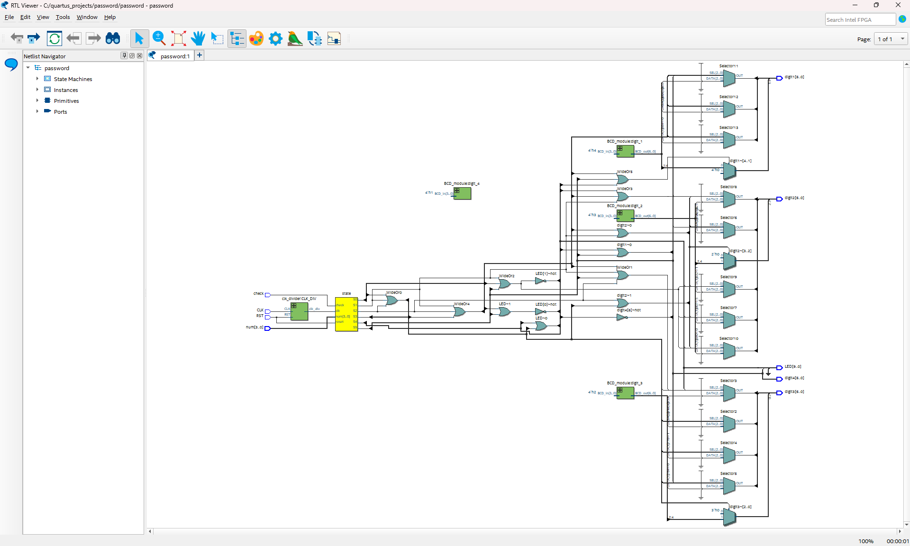
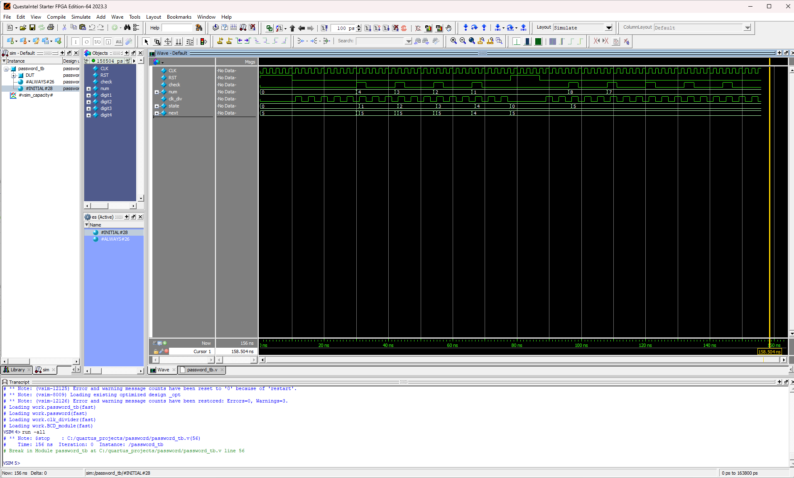

# Práctica #4: Contraseña FSM

## Descripción del proyecto
Este proyecto implementa un sistema de una máquina de estados y de 4 displays de 7 segmentos, utilizando **Verilog HDL** en **Quartus Prime**, ejecutándose en la tarjeta **DE-10 Lite**.

El sistema consta de una máquina de estados, que al recibir el dígito correcto de una contraseña, cambia de estado para verificar el siguiente digito. La máquina también despliega diferentes mensajes dependiendo si la contraseña es correcta. 

## Estructura del proyecto
El proyecto está dividido en cinco módulos principales:

## 1) Codificador BCD a 7 segmentos
- **Entrada**: Valor BCD de 4 bits (0-9)
- **Salida**: Señal de 4 bits (segmentos 0-6)

## 2) Divisor de relój
- **Entrada**: Reloj de la tarjeta FPGA
- **Salida**: Señal de reloj dividida (1 Hz)

## 3) Módulo FSM para la contraseña
- **Entrada**: Valor de entrada, señales básicas (clk, rst, check)
- **Salida**: Señal de las pantallas y LEDs

Este módulo:
- Implementa una máquina de 6 estados
- Separa la lógica en 3 bloques
- Es manejado por la señal de relój lenta
- Instancia los módulos previos
- También se encarga de producir las señales para las pantallas 

## 4) Testbench
El **testbench** permite ejecutar una simulación del sistema en *ModelSim* para verificar que las salidas sean correctas.

Este modulo:
- Primero verifica que al poner la contraseña, resulte en "Good"
- Luego genera 5 números aleatorios
- Genera una visualización de onda en ModelSim

### Visualización RTL Viewer:

### Visualización de onda:

## 5) Modulo Top-Level (Wrap)
El archivo _wrap_ conecta todo el diseño con la tarjeta DE-10 Lite:
- Relój: Señal de relój de la tarjeta FPGA
- Switches: Señal reset y entradas para la contraseña
- Displays HEX: Salidas de los 7 segmentos

Las asignaciones de pines se realizaron con *Pin Planner* de Quartus. Los pines se mapean automáticamente mediante un archivo de mapeo `.tcl` para la tarjeta DE-10 Lite.

## Conceptos aplicados
- Instanciacion de modulos
- Conversión de binario a dígitos decimales
- Asignación de pines en FPGA
- Implementación de una máquina de estados
- Integración de lógica digital con hardware real

## Resultado final
Al ingresar los dígitos correctos de una contraseña, se despliega el mensaje "Good" en la pantalla y "Bad" a lo contrario. 

## Demostración con FPGA DE-10 Lite

(Haz clic en la imágen para ver el video)
