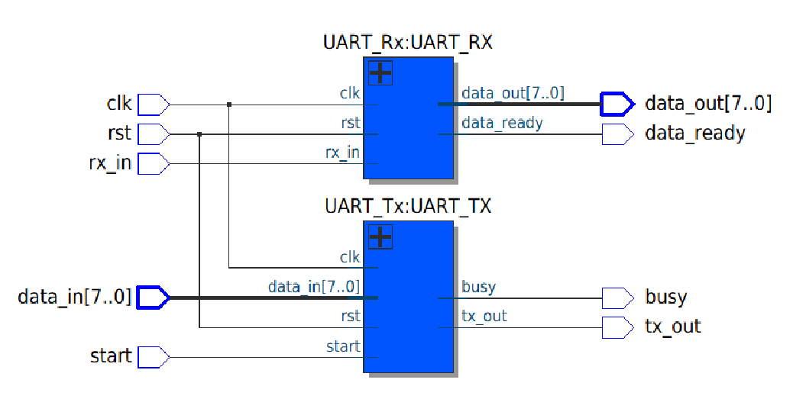
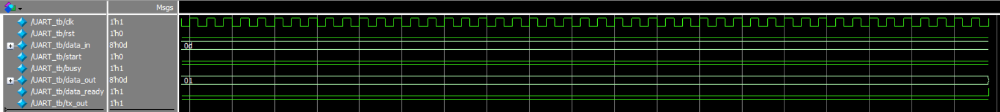
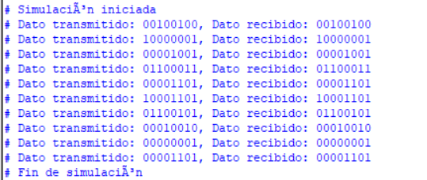

# Práctica #6: Protocolo de comunicación serial UART

## Descripción del proyecto
Este proyecto implementa un sistema FSM, UART y 4 displays de 7 segmentos, utilizando **Verilog HDL** en **Quartus Prime**, ejecutándose en la tarjeta **DE-10 Lite**.

El sistema ingresa un valor con los interruptores y los manda mientras que otra tarjeta FPGA recibe la transmisión de datos y los interpreta con sus pantallas de 7 segmentos.

## Estructura del proyecto
El proyecto está dividido en siete módulos principales:

## 1) Codificador BCD a 7 segmentos
- **Entrada**: Valor BCD de 4 bits (0-9)
- **Salida**: Señal de 4 bits (segmentos 0-6)

## 2) Conversor de valor de 8 bits a 3 displays
- **Entrada**: Número binario de 8 bits
- **Salida**: Señales para tres displays de 7 segmentos

## 3) Módulo de transmisión (Tx)
- **Entrada**: Señales básicas (clk, rst, start) y entrada de los interruptores, 
- **Salida**: Booleano _busy_ y bus de transmisión

Este módulo:
- Implementa una máquina de estados para Tx
- Manda el dato ingresado con los interruptores
- Utiliza un *baud rate* de 9600
- Produce _!busy_ cuando termina la transmisión

## 4) Módulo de recepción (Rx)
- **Entrada**: Señales básicas (clk, rst) y bus de recepción
- **Salida**: Dato leido y booleano _data-ready_

Este módulo:
- Implementa una máquina de estados para Rx
- Lee e interpreta la lectura de la transmisión _tx-out_
- Utiliza un *baud rate* de 9600
- Produce _data-ready_ cuando los 8 bits fueron leídos

## 5) Módulo UART
- **Entrada**: Combinación de entradas Tx y Rx
- **Salida**: Combinación de salidas Tx y Rx

Este módulo:
- Instancia todos los módulos anteriores
- Implementa un sistema UART de una sola tarjeta
- Fue hecho para hacer la prueba *test bench*

## 6) Testbench
El **testbench** permite ejecutar una simulación del sistema en *ModelSim* para verificar que las salidas sean correctas.

Este modulo:
- Elige valores aleatorios de 8 bits
- Simula la transmisión y recepción de un mismo dato con una sola tarjeta FPGA
- Genera una visualización de onda en ModelSim

### Visualización RTL Viewer:

### Visualización de onda:

### Resultados en la terminal:

## 7) Módulo Top-Level (Wrap) para Tx y Rx
El archivo _wrap_ conecta todo el diseño con la tarjeta DE-10 Lite:
- Clock: Relój de la tarjeta FPGA (50 MHz)
- Key: Uso de ambos botónes en la DE-10 Lite
- Switches: Entrada por mandar mediante Tx
- Displays HEX: Salidas de los 7 segmentos
- LED: Utiliza los LEDs para especificar el estados de los sistemas
- Arduino IO: Bus de transmisión/recepción

Las asignaciones de pines se realizaron con *Pin Planner* de Quartus. Los pines se mapean automáticamente mediante un archivo de mapeo `.tcl` para la tarjeta DE-10 Lite.

## Conceptos aplicados
- Instanciación de módulos
- Conversión de binario a dígitos decimales
- Asignación de pines en FPGA
- Protocolo de comunicación serial UART
- Parametrización de *baud rate*
- Diseño de lógica asíncrona
- Integración de lógica digital con hardware real

## Resultado final
Al ingresar un número binario con los switches de la primera FPGA, se comienza a mandar cada bit del dato a otra tarjeta de recepción. La segunda FPGA interpreta los datos y los refleja en 3 de las pantallas de 7 segmentos.

## Demostración con FPGA DE-10 Lite

### Ingreso de los valores:

### Verificación de envío:

### Recepción de dato:

